# UEE2304 Data Structure
Homework source codes and note of [Data Structure](https://course.nctu.edu.tw/Course/CrsOutline/show.asp?Acy=104&Sem=1&CrsNo=1077&lang=en-us) in NCTU ECE in 2015 fall.
Textbook: *Data Structures: A Pseudocode Approach with C*, Second Edition. Richard F. Gilberg. Behrouz A. Forouzan.

## Index
- [Chapter 1: Basic concepts](https://github.com/coldmanck/UEE2304-Data-Structure/blob/master/README.md#chapter-1-basic-concepts)
- [Chapter 2: Recursion](https://github.com/coldmanck/UEE2304-Data-Structure/blob/master/README.md#chapter-2-recursion)
- [Chapter 3: Stack](https://github.com/coldmanck/UEE2304-Data-Structure/blob/master/README.md#chapter-3-stack)
- [Chapter 4: Queue](https://github.com/coldmanck/UEE2304-Data-Structure/blob/master/README.md#chapter-4-queue)
- [Chapter 5: General Linear Lists](https://github.com/coldmanck/UEE2304-Data-Structure/blob/master/README.md#chapter-5-general-linear-lists)
- [Chapter 6: Introduction to Trees](https://github.com/coldmanck/UEE2304-Data-Structure/blob/master/README.md#chapter-6-introduction-to-trees)
- [Chapter 7: Binary Search Tree](https://github.com/coldmanck/UEE2304-Data-Structure/blob/master/README.md#chapter-7-binary-search-tree)
- [Chapter 8: AVL Search Tree](https://github.com/coldmanck/UEE2304-Data-Structure/blob/master/README.md#chapter-8-avl-search-tree)
- [Chapter 9: Heaps](https://github.com/coldmanck/UEE2304-Data-Structure/blob/master/README.md#chapter-9-heaps)
- [Chapter 10: Multiway Trees](https://github.com/coldmanck/UEE2304-Data-Structure/blob/master/README.md#chapter-10-multiway-trees)
- [Chapter 11: Graphs](https://github.com/coldmanck/UEE2304-Data-Structure/blob/master/README.md#chapter-11-graphs)
- [Chapter 12: Sorting](https://github.com/coldmanck/UEE2304-Data-Structure/blob/master/README.md#chapter-12-sorting)
- [Chapter 13: Searching](https://github.com/coldmanck/UEE2304-Data-Structure/blob/master/README.md#chapter-13-searching)

## Chapter 1: Basic concepts
A **data structure** is an aggregation of atomic and composite data into a set with defined relationships. A **abstract data type** is a data declaration packaged together with the operations that are meaningful for the data tyoe.

### Model for an ADT
- ADT Operations: Data are entered, accessed, modified and deleted through the external interface (public functions). Private functions and data are not allowed to be accessed straighfoward. 
- ADT Data Structure: we hide the implementation from the user while being able to store different data (e.g. stacks, queues, lists, BST, AVL trees, B-trees, heaps, graphs, etc.)

### ADT Implementation
One can implement ADT lists by 2 basic structures: arrays and linked lists.

## Generic Code for ADTs
Generic code allow us to write one set of code and apply it to any data type. In C, there're mainly 2 features: pointer to void and pointer function.
- Pointer to void: 
```
void *p;  int i = 3;  float f = 7.5;
p = &i; printf("%d", *(int*)p);   // 3
p = &f; printf("%f", *(float*)p); // 7.5
```
  remember that we cannot use `*p` without casting. That is, **a pointer to void cannot be dereferenced**. Then we can use pointer to void to describe a example -- node structure
```
typedef struct node {
  void* data;
  struct node* link;
} NODE;
```
- Pointer to function: `int (*ptrToCmpFun)(void*, void*);`
Below, we define a generic function which return the larger one without knowing exact data type.
```
void* larger (void* dataPtr1, void* dataPtr2, int (*ptrToCmpFun)(void*, void*)){
  if((*ptrToCmpFun)(dataPtr1, dataPtr2) > 0)
    return dataPtr1;
  else
    return dataPtr2;
}

int compare(void* a, void* b){
  if(*(int*)a > *(int*)b)
    return 1;
  else
    return -1;
}

// int a = 1, b = 2;
// int lrg = *(int*)larger(&a, &b, compare); // lrg <- 2
```

## Chapter 2: Recursion
### Designing a recursive algorithm
1. Determine the base case and the general case.
2. Combine them into an algorithm.
```
/* Example: print input data reversely */
Algorithm printReverse(data)
  if (end of input) 
    return
  else
    read data
    printReverse(data)
    print data
    return
  end if
```

### 3 Principles of examing whether recursion is good
1. Is the algorithm or data structure naturally suited to recursion?
  - e.g. Lists are not.
2. Is the recursive solution shorter and more understandable?
3. Does the recursive solution run within accpetable time and space limits?
  - e.g. if time complexity if `O(n)`, maybe it's not.

### Example: Hanoi Tower
Generalization of the problem:
1. Move `n-1` disks from source to auxiliary. (General case)
2. Move `1` disk from source to destination. (Base case)
3. Move `n-1` disks from auxiliary to destination. (General case)
```
/* Hanoi Tower in C */
void hanoi(int num, int src, int aux, int des){
	if(num == 1)
		printf("Move %d from %d to %d\n", num, src, des);
	else{
		hanoi(num - 1, src, des, aux);
		printf("Move %d from %d to %d\n", num, src, des);
		hanoi(num - 1, aux, src, des);
	}
}
// hanoi(3, 1, 2, 3);
```
## Chapter 3: Stack
Linear list can be divided into 2 types: restricted and general list. Restricted one is sth like stacks and queues, while general list is sth that can be operated in a variety of conditions. The stack is one of 3 data structures known collectively as *restrictive data structures* because the operations are restricted to the ends of the structure. The other 2 are the queue and the dequq (i.e. double-ended queue).

### 3 basic stack operations on the stack
- Push: push the data onto the stack top
- Pop: return the data in the top element and delete it
- Top: return the data in the top element but doesn't do anything on it

### 8 stack operations defined on she stack
- createStack()
- pushStack(stack, data)
- popStack(stack, data)
- stackTop(stack, data)
- emptyStack(stack)
- fullStack(stack)
- stackCount(stack)
- destroyStack(stack)

### Main usage of stack
- reverse of data
- convertion (decimal <-> binary)
- parsing (verifying parenthese pair)
- postponement (infix -> postfix, evaluating postfix expression)
- backtracking (goal seeking, the eight queens problem)

## Chapter 4: Queue
A queue is a linear list in which data can only be inserted at one end, called the rear, and deleted from the other end, called the front. This operation ensure a queue is a FIFO structure.

### Basis operations
- enqueue
- dequeue
- queueFront
- queueRear

### Data structures
1. Node
```
typedef queueNode {
  void* data;
  queueNode* link;
} queueNode*
```
2. Head
```
typedef queueHead {
  queueNode* front;
  queueNode* rear;
  int count;
} queueHead;
```

### Operations
- categorizing data (rearrange into a couple of categories)
- queue simulation

## Chapter 5: General Linear Lists
A general linear list is a list in which operations, such as retrievals, insertions, changes, and deletions can be done anywhere in the list. For simplicity, we refer to general linear lists as lists from now on.

### Basic Operations
- Insertion
- Deletion
- Retrieval: it requires that data be located in a list and presented to the calling module without changing the contens of the list.
- Traversal: each execution of the traversal process 1 element in the list.

### List ADT
- Type definition:
```
typedef struct node {
  void* dataPtr;
  struct node* link;
} NODE;

typedef struct {
  int count;
  NODE* pos;
  NODE* head;
  NODE* rear;
  int (*compare)(void* arg1, void* arg2);
} LIST;
```

## Other implementations
- Circularly Linked List: the last node’s link points to the first node of the list
- Doubly Linked List: each data node has a pointer to both its successor and its predecessor
- Multilinked List: a list with two or more logical key sequences

## Chapter 6: Introduction to Trees
### Terminology
- parent, child, siblings, ancestor, descendent, leaf, root node
- path: a sequence of nodes in which each node is adjacent to the next one.
- the **level of a node** is its distance from the **root**.
- the **height of a tree** is the number of levels of the tree. (i.e. the longest path from the deepest leaf node to the root)
- right, left subtree
- general tree and binary tree

### Properties of Binary Tree
we can define several properties for binary trees that distinguish them from general trees. Providing there're `N` nodes in the binary tree: 
- Maximum Height `Hmax = N`
- Minimum Height `Hmin = |_ log2N _| + 1`
- Maximum Nodes `Nmax = 2^H - 1`
- Minimum Nodes `Nmin = H`
- Balance: a balanced binary tree, the height of any node of a tree should differ by no more than 1, defined by AVL Tree.
- Complete (Perfect) Trees: a tree which has the maximum number of entries for its height (`Nmax = 2^H - 1`)
- Nearly Complete (Complete but not perfect) Tree: a tree has the minimum height for its nodes (`Hmin = |_ log2N _| + 1`) and all nodes in the last level are found on the left.

### Binary Tree Traversals
- Depth-First Traversal: using stack
  - Preorder (NLR)
  - Inorder (LNR)
  - Postorder (LRN)
- Breadth-First Traversal: using queue

### Application of Binary Tree: Expression Tree
An **expression tree** is a binary tree with the following properties:
- Each leaf is an operand
- The root and internal nodes are operators.
- Subtrees are subexpressions, with the root being an operator.
There're also 3 type of traversal of an expression tree: **infix, prefix and postfix traversal**, which exploit inorder, preorder and postorder traversal, individually.

### Application Binary Tree: Huffman Code
Huffman code makes character storage more efficient than common ASCII-style character representation. In Huffman code we assign shorter codes to characters that occur more fre- quently and longer codes to those that occur less frequently.

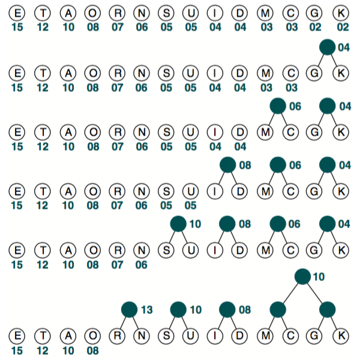

After several steps,

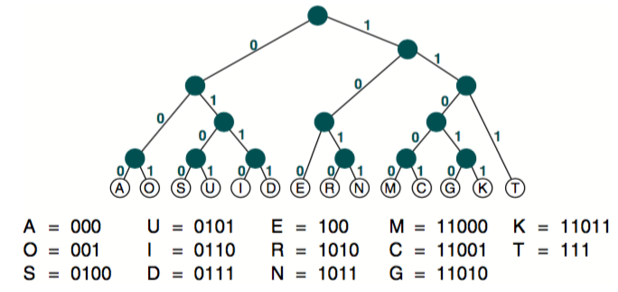

### General Trees
A general tree is a tree in which each node can have an unlimited outdegree. There're 2 types of insertion in general trees:
- FIFO
- LIFO
One can easily convert general trees to binary trees, by connecting the siblings of the same level and deleting unneeded branches.

## Chapter 7: Binary Search Tree
A binary search tree (BST) is a binary tree with the following properties:
- All items in the left subtree are less than the root
- All items in the right subtree are greater than or equal to the root
- Each subtree is itself a binary search tree

### ADT of Binary Search Tree
1. node
```
typedef struct node {
  struct node* left;
  struct node* right;
  void* dataPtr;
} NODE;
```
2. BST_TREE
```
typedef struct {
  NODE* root;
  int count;
  int (*compare)(void* arg1, void* arg2);
} BST_TREE;
```

### Threaded Trees
Binary tree traversal algorithms are written using either recursion or programmer-written stacks. If the tree must be traversed frequently, using **stacks** rather than recursion may be more efficient. A third alternative is threaded tree. In a threaded tree, null pointers are replaced with pointers to their successor nodes. The reason we use recursion or a stack is that, at each step, we cannot access the next node in the sequence directly and we must use backtracking. The traversal is more efficient if the tree is a threaded tree.

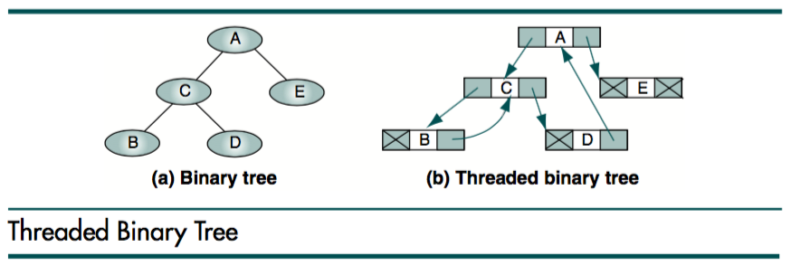

## Chapter 8: AVL Search Tree
An AVL tree is a binary tree that either is empty or consist of 2 AVL subtrees, TL and TR, whose heights differ by no more than 1. **AVL tree balance factor** is a balance factore as the height of the lefft subtree minus that of the right subtree. When AVL tree balance factor represent different conditions when having specific value:
- +1 : left high (LH) 
- 0  : even high (EH)
- -1 : right high (RH)

### Balancing Trees
All unbalanced trees fall into one of those 4 cases:
1. Left of left -> right rotate
2. Right of right -> left rotate
3. Right of left -> left then right rotate
4. Left of right -> right then left rotate

### AVL Tree Implementataions
- Insert into AVL Tree: similar to the BST's add noe but check if balance when way back to root.
```
Algorithm AVLInsert(root, newData)
  if(subtree empty)
    insert newData at root
    return root
  end if
  if(newData < root)
    AVLInsert(left subtree, newData)
    if(left subtree taller)
      leftBalance(root)
    end if
  else
    AVLInsert(right subtree, newData)
    if(right subtree taller)
      rightBalance(root)
    end if
  end if
  return root
end AVLInsert
```
- AVL Tree Left Balance Algorithm:
```
Algorithm leftBalance(root)
  if(left subtree high)
    rotateRight(root)
  else
    rotateLeft(left subtree)
    rotateRight(root)
  end if
end leftBalance
```
- AVL Tree Rotate Algorithm (right and left)
```
Algorithm rotateRight(root)
  exchange left subtree with right subtree of left subtree
  make left subtree new root
end rotateRight

Algorithm rotateLeft(root)
  exchange right subtree with left subtree of right subtree
  make right subtree new root
end rotateLeft
```
- AVL Tree Delete Algorithm
Follow the logic of deletion of BST, all deletions must take place at a leaf node.
```
Algorithm AVLDelete (root, dltKey, success)
  if Return (empty subtree)
    set success to false
    return null
  end if
  if (dltKey < root)
    set left subtree to AVLDelete(left subtree, dltKey, success)
    if(tree shorter)
      set root to deleteRightBalance(root)
    end if
  elseif(dltKey > root)
    set right subtree to AVLDelete(right subtree, dltKey, success)
    if(tree shorter)
      set root to deleteLeftBalance(root)
    end if
  else
    save root
    if(no right subtree)
      set success to true
      return left subtree
    elseif(no left subtree)
      set success to true
      return right subtree
    else
      find largest node on left subtree // or find smallest node on right subtree
      save largest key
      copy data in largest to root
      set left subtree to AVLDelete(left subtree, largest key, success)
      if(tree shorter)
        set root to deleteRightBalance(root)
      end if
    end if
  end if
  return root
end AVLDelete
```
### AVL Tree ADT
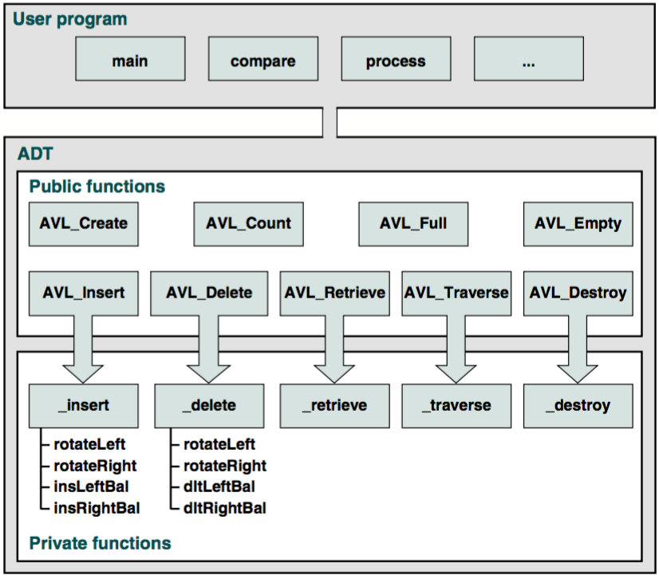

### AVL Data Structure
1. node
```
typedef struct node {
  struct node* left;
  struct node* right;
  void* dataPtr;
  int bal;
} NODE;
```
2. root
```
typedef struct {
  int count;
  NODE* root;
  int (*compare) (void* arg1, void* arg2);
} AVL_TREE;
```

## Chapter 9: Heaps
A heap is a binary tree whose left and right subtrees have values less than their parents. The root of a heap is guaranteed to hold the largest node in the tree. A **max-heap** is a complete or nearly complete (perfect or complete but not perfect) binary tree in which the key value in a node is greater than or equal to the key values in all of its subtrees, and the subtrees are in turn heaps.

### Implementation
Heap is often implemented with array. This is because heap is always complete or nearly complete (perfect or complete but not perfect) binary tree. There're several common knowledge about heap. For a node of index `i`, one can find its 
1. left descedent at `2 * i + 1` and right descedent at `2 * i + 2`
2. parent node at `|_ (i - 1) / 2 _|`, where `|_ _|` means an integer that smaller than or equal to a specific number.
3. right sibling at `i + 1` and left sibling at `i - 1`
4. given a complete heap and size `n`, the most left node's index is `|_ n / 2 _|`.

### Matintenance Operations and Algorithms
- Reheap Up: reorders a "broken" heap by floating the last element up the tree until it is in its correct location in the heap.
- Reheap Down: reorders a "broken" heap by pushiong the root down the tree until it is in its correct position in the heap.

### Heap ADT
Heap is essentially can be implemented by an array. As a result, in code definition there's no need to define the node data structure but only head node (`HEAP`).
```
typedef struct {
  void** heapAry;
  int last;
  int size;
  int (*compare)(void* arg1, void* arg2);	// this compare function should be embedded into HEAP while initialization
  int maxSize;
} HEAP;
```
An important thing should be known is that, deletion of a heap usually means delete the **root** node. The largest node in the heap is that we're concerned about.

### Applications
- Selection Algorithms: select the k-th largest element from a list
- Priority Queues: creating orderly queue with priority
- Sorting: heap sort

## Chapter 10: Multiway Trees
Whereas each node in a binary tree has only one entry, multiway trees have multiple entries in each node and thus may have multiple subtrees.

### M-way Search Trees
An m-way tree is a search tree in which each node can have from 0 to m subtrees, where m is defined as the **B-tree order**. Given a nonempty multiway tree, we can identify the following properties:
1. Each node has 0 to m subtrees
2. A node with k (<m) subtrees contains k subtrees and k-1 data entries.
3. The keys of the data entries are ordered key1 <= key2 <= key3 <=... <= keyk
4. All subtrees are themselves multiway trees.
And in face, the BST is an special m-way tree of order 2.

### B-trees
A B-tree is an m-way search tree with the following additional properties:
1. The root is either a leaf or it has 2 ... m subtrees, and m means the order of this B-tree.
2. All internal nodes have at least m / 2 nonnull subtrees and at most m nonnull subtrees.
3. All leaf nodes are at the same level; that is, the tree is perfectly balanced. 
4. A leaf node has at least m / 2 – 1 and at most m – 1 entries.

## Implementation of B-trees
The four basic operations for B-trees are: insert, delete, traverse, and search.

- Insertion
The process of inserting an entry into the parent provides an interesting contrast to the binary search tree. Recall that the binary search tree grew in an unbalanced fashion from the top down. B-trees grow in a balanced fashion from the bottom up. When the root node of a B-tree overflows and the median entry is pushed up, a new root node is created and the tree grows one level.

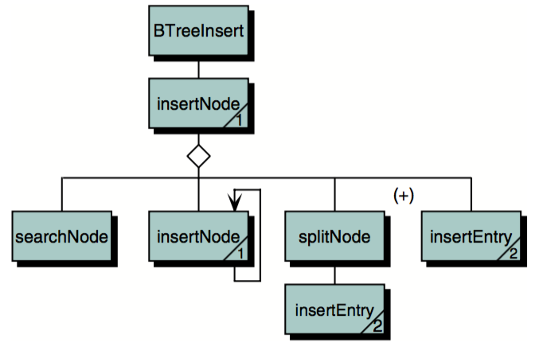

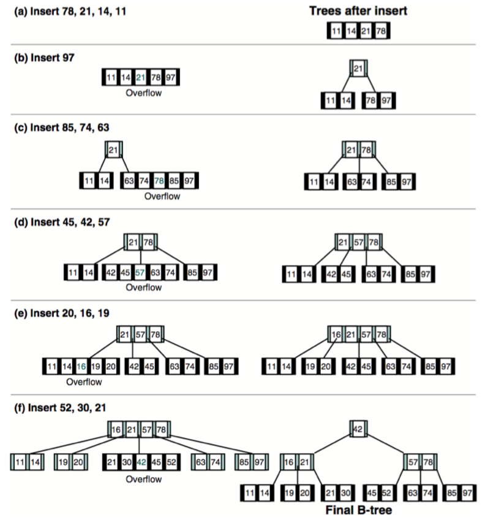

- Deletion
There are three considerations when deleting a data entry from a B-tree node. First, we must ensure that the data to be deleted are actually in the tree. Sec- ond, if the node does not have enough entries after the deletion, we need to correct the structural deficiency. A deletion that results in a node with fewer than the minimum number of entries is an underflow. Finally, as we saw with the binary search tree, we can delete only from a leaf node. Therefore, if the data to be deleted are in an internal node, we must find a data entry to take their place.

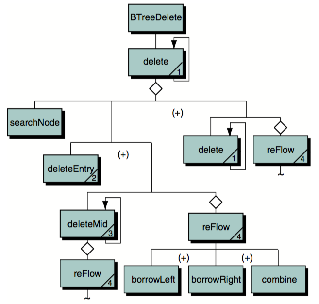

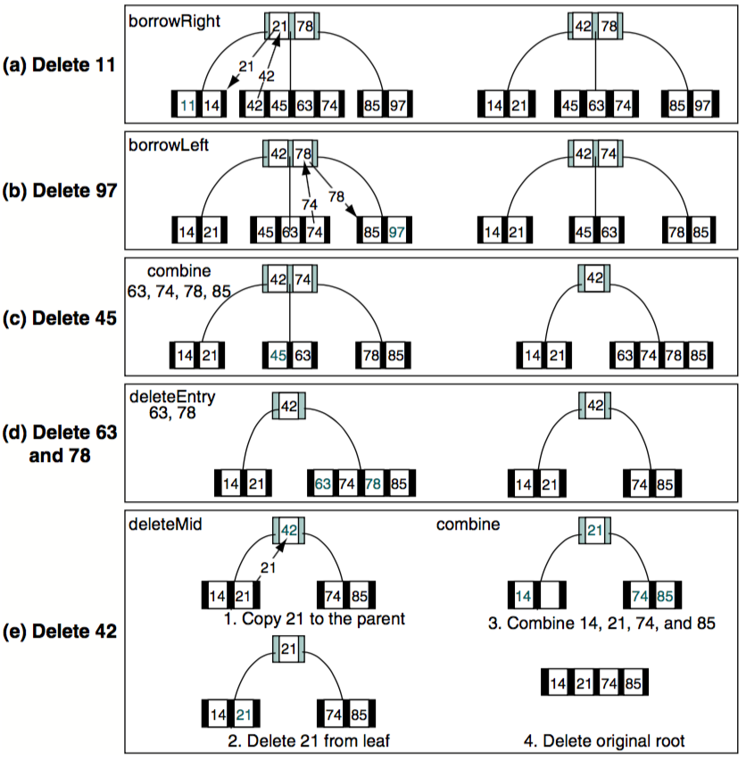

- Traversal
- Search

### B-Tree's ADT
The main data structure of a B-tree is *BTREE*, which consists of *NODE* and *ENTRY*.
```
typedef struct {
  void* dataPtr;
  NODE* right;
} ENTRY;

typedef struct node {
  NODE* left;
  int numEntries;
  ENTRY entries[ORDER-1]
} NODE;

typedef struct {
  NODE* root;
  int count;
  int (*compare)(void* arg1, void* arg2);
} BTREE;
```

### Simplified B-Tree
1. 2-3 Tree: The 2-3 tree is a B-tree of order 3.
2. 2-3-4 Tree: The 2-3-4 tree is a B-tree of order 4.

### B-Tree Variations
**B*tree**: There're some different characteristic with B-tree.
- each node containing a minimum of two-thirds (2/3) the maximum entries.
- when a node overflows, instead of being split immediately, the data are redistributed among the node’s siblings.
- Splitting occurs only when all of the siblings are full. Further- more, when the nodes are split, data from two full siblings are divided among the two full nodes and a new node, with the result that all three nodes are two-thirds full.

**B+tree**: There are two differences between the B-tree and the B+tree:

- Each data entry must be represented at the leaf level, even though there may be internal nodes with the same keys. Because the internal nodes are used only for searching, they generally do not contain data.
- Each leaf node has one additional pointer, which is used to move to the next leaf node in sequence.

**Lexical Tree**

Each entry in the lexical search tree contains a pointer to the next level. In addition, each node of a 26-ary tree contains 26 pointers.

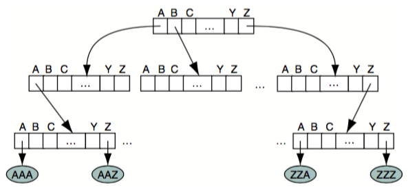

**Tries**

Trie is a kind of improved m-ary tree which prunes unused subtrees; that is, cuat all of the branches that are not needed.

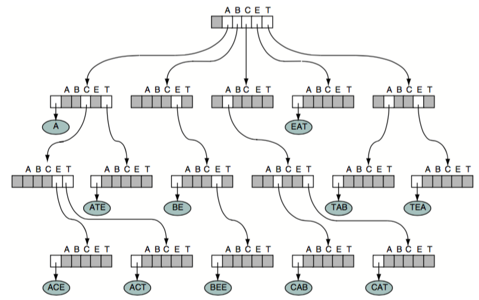

## Chapter 11: Graphs
Graph is a special data structure that differs from all of the others in one major concept: **each node may have multiple predecessors as well as multiple successors**. Graphs may be directed or undirected. In a **directed** graph, each line, called an *arc*, has a direction indicating how it may be traversed. In an **undirected** graph, the line is known as an *edge*, and it may be traversed in either direction. Two vertices in a graph are said to be **adjacent** vertices (or neighbors) if there is a path of length 1 connecting them. For example, if there's a arc from A to B, we can say B is adjacent to A but not vice versa. 

- A **cycle** is a path consisting of at least three vertices that starts and ends with the same vertex. 
- A **loop** is a special case of a cycle in which a single arc begins and ends with the same vertex.
- A directed graph is **strongly connected** if there is a path from each vertex to every other vertex in the digraph.
- A directed graph is **weakly connected** if at least two vertices are not connected
- A graph is a **disjoint graph** if it is not connected.
- The **degree** of a vertex is the number of lines incident to it.

### Traversal of Graph
- Depth-First Search (DFS): all of a node’s descendents are processed before moving to an adjacent node.
- Breadth-First Search (BFS):  all adjacent vertices are processed before processing the descendents of a vertex.

### Adjacency Matrix
The adjacency matrix uses a vector (one-dimensional array) for the vertices and a matrix (two-dimensional array) to store the edges.

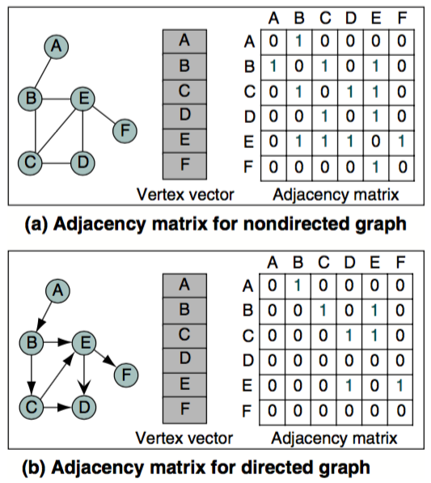

### Adjacency List
The adjacency list uses a two-dimensional ragged array to store the edges. The vertex list is a singly linked list of the vertices in the list. Depending on the application, it could also be implemented using doubly linked lists or cir- cularly linked lists. The pointer at the left of the list links the vertex entries. The pointer at the right in the vertex is a head pointer to a linked list of edges from the vertex.

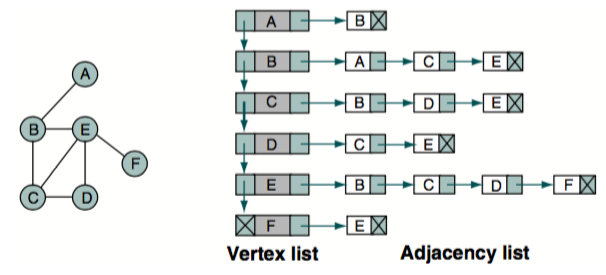

### Graph Data Structure
```
typedef struct {
  int count; 
  struct vertex* first; 
  int (*compare)(void* argu1, void* argu2);
} GRAPH;

typedef struct vertex {
  struct vertex* pNextVertex;
  void* dataPtr;
  int inDegree;
  int outDegree;
  short processed;
  struct arc* pArc;
} VERTEX;

typedef struct arc {
  struct vertex* destination;
  struct arc* pNextArc; 
} ARC;
```

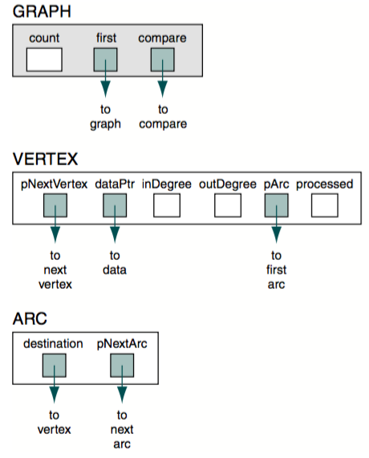

### Networks
A network is a graph whose lines are weighted.

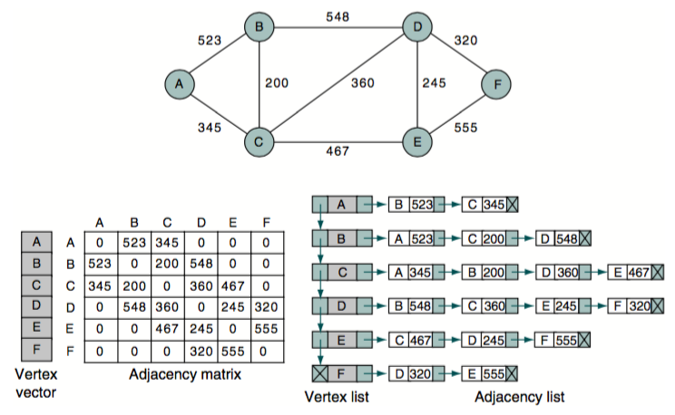

A **spanning tree** contains all of the vertices in a graph. A **minimum spanning tree** is a spanning tree in which the total weight of the lines is guaranteed to be the minimum of all possible trees in the graph.

**Shortest Path Algorithm**
The Dijkstra algorithm is used to find the shortest path between any two nodes in a graph. 

## Chapter 12: Sorting
## Chapter 13: Searching
