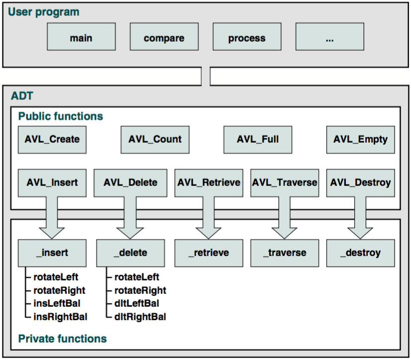

# UEE2304-Data-Structure
Homework codes and note of [Data Structure](https://course.nctu.edu.tw/Course/CrsOutline/show.asp?Acy=104&Sem=1&CrsNo=1077&lang=en-us) in NCTU ECE in 2015 fall.

## Chapter 1: Basic concepts
A **data structure** is an aggregation of atomic and composite data into a set with defined relationships. A **abstract data type** is a data declaration packaged together with the operations that are meaningful for the data tyoe.

### Model for an ADT
- ADT Operations: Data are entered, accessed, modified and deleted through the external interface (public functions). Private functions and data are not allowed to be accessed straighfoward. 
- ADT Data Structure: we hide the implementation from the user while being able to store different data (e.g. stacks, queues, lists, BST, AVL trees, B-trees, heaps, graphs, etc.)

### ADT Implementation
One can implement ADT lists by 2 basic structures: arrays and linked lists.

## Generic Code for ADTs
Generic code allow us to write one set of code and apply it to any data type. In C, there're mainly 2 features: pointer to void and pointer function.
- Pointer to void: 
```
void *p;  int i = 3;  float f = 7.5;
p = &i; printf("%d", *(int*)p);   // 3
p = &f; printf("%f", *(float*)p); // 7.5
```
  remember that we cannot use `*p` without casting. That is, **a pointer to void cannot be dereferenced**. Then we can use pointer to void to describe a example -- node structure
```
typedef struct node {
  void* data;
  struct node* link;
} NODE;
```
- Pointer to function: `int (*ptrToCmpFun)(void*, void*);`
Below, we define a generic function which return the larger one without knowing exact data type.
```
void* larger (void* dataPtr1, void* dataPtr2, int (*ptrToCmpFun)(void*, void*)){
  if((*ptrToCmpFun)(dataPtr1, dataPtr2) > 0)
    return dataPtr1;
  else
    return dataPtr2;
}

int compare(void* a, void* b){
  if(*(int*)a > *(int*)b)
    return 1;
  else
    return -1;
}

// int a = 1, b = 2;
// int lrg = *(int*)larger(&a, &b, compare); // lrg <- 2
```

## Chapter 2: Recursion
### Designing a recursive algorithm
1. Determine the base case and the general case.
2. Combine them into an algorithm.
```
/* Example: print input data reversely */
Algorithm printReverse(data)
  if (end of input) 
    return
  else
    read data
    printReverse(data)
    print data
    return
  end if
```

### 3 Principles of examing whether recursion is good
1. Is the algorithm or data structure naturally suited to recursion?
  - e.g. Lists are not.
2. Is the recursive solution shorter and more understandable?
3. Does the recursive solution run within accpetable time and space limits?
  - e.g. if time complexity if `O(n)`, maybe it's not.

### Example: Hanoi Tower
Generalization of the problem:
1. Move `n-1` disks from source to auxiliary. (General case)
2. Move `1` disk from source to destination. (Base case)
3. Move `n-1` disks from auxiliary to destination. (General case)
```
/* Hanoi Tower in C */
void hanoi(int num, int src, int aux, int des){
	if(num == 1)
		printf("Move %d from %d to %d\n", num, src, des);
	else{
		hanoi(num - 1, src, des, aux);
		printf("Move %d from %d to %d\n", num, src, des);
		hanoi(num - 1, aux, src, des);
	}
}
// hanoi(3, 1, 2, 3);
```
## Chapter 3: Stack
Linear list can be divided into 2 types: restricted and general list. Restricted one is sth like stacks and queues, while general list is sth that can be operated in a variety of conditions. The stack is one of 3 data structures known collectively as *restrictive data structures* because the operations are restricted to the ends of the structure. The other 2 are the queue and the dequq (i.e. double-ended queue).

### 3 basic stack operations on the stack
- Push: push the data onto the stack top
- Pop: return the data in the top element and delete it
- Top: return the data in the top element but doesn't do anything on it

### 8 stack operations defined on she stack
- createStack()
- pushStack(stack, data)
- popStack(stack, data)
- stackTop(stack, data)
- emptyStack(stack)
- fullStack(stack)
- stackCount(stack)
- destroyStack(stack)

### Main usage of stack
- reverse of data
- convertion (decimal <-> binary)
- parsing (verifying parenthese pair)
- postponement (infix -> postfix, evaluating postfix expression)
- backtracking (goal seeking, the eight queens problem)

## Chapter 4: Queue
A queue is a linear list in which data can only be inserted at one end, called the rear, and deleted from the other end, called the front. This operation ensure a queue is a FIFO structure.

### Basis operations
- enqueue
- dequeue
- queueFront
- queueRear

### Data structures
1. Node
```
typedef queueNode {
  void* data;
  queueNode* link;
} queueNode*
```
2. Head
```
typedef queueHead {
  queueNode* front;
  queueNode* rear;
  int count;
} queueHead;
```

### Operations
- categorizing data (rearrange into a couple of categories)
- queue simulation

## Chapter 5: General Linear Lists
A general linear list is a list in which operations, such as retrievals, insertions, changes, and deletions can be done anywhere in the list. For simplicity, we refer to general linear lists as lists from now on.

### Basic Operations
- Insertion
- Deletion
- Retrieval: it requires that data be located in a list and presented to the calling module without changing the contens of the list.
- Traversal: each execution of the traversal process 1 element in the list.

### List ADT
- Type definition:
```
typedef struct node {
  void* dataPtr;
  struct node* link;
} NODE;

typedef struct {
  int count;
  NODE* pos;
  NODE* head;
  NODE* rear;
  int (*compare)(void* arg1, void* arg2);
} LIST;
```

## Other implementations
- Circularly Linked List: the last node’s link points to the first node of the list
- Doubly Linked List: each data node has a pointer to both its successor and its predecessor
- Multilinked List: a list with two or more logical key sequences

## Chapter 6: Introduction to Trees
TBA

## Chapter 7: Binary Search Tree
TBA

## Chapter 8: AVL Search Tree
An AVL tree is a binary tree that either is empty or consist of 2 AVL subtrees, TL and TR, whose heights differ by no more than 1. **AVL tree balance factor** is a balance factore as the height of the lefft subtree minus that of the right subtree. When AVL tree balance factor represent different conditions when having specific value:
- +1 : left high (LH) 
- 0  : even high (EH)
- -1 : right high (RH)

### Balancing Trees
All unbalanced trees fall into one of those 4 cases:
1. Left of left -> right rotate
2. Right of right -> left rotate
3. Right of left -> left then right rotate
4. Left of right -> right then left rotate

### AVL Tree Implementataions
- Insert into AVL Tree: similar to the BST's add noe but check if balance when way back to root.
```
Algorithm AVLInsert(root, newData)
  if(subtree empty)
    insert newData at root
    return root
  end if
  if(newData < root)
    AVLInsert(left subtree, newData)
    if(left subtree taller)
      leftBalance(root)
    end if
  else
    AVLInsert(right subtree, newData)
    if(right subtree taller)
      rightBalance(root)
    end if
  end if
  return root
end AVLInsert
```
- AVL Tree Left Balance Algorithm:
```
Algorithm leftBalance(root)
  if(left subtree high)
    rotateRight(root)
  else
    rotateLeft(left subtree)
    rotateRight(root)
  end if
end leftBalance
```
- AVL Tree Rotate Algorithm (right and left)
```
Algorithm rotateRight(root)
  exchange left subtree with right subtree of left subtree
  make left subtree new root
end rotateRight

Algorithm rotateLeft(root)
  exchange right subtree with left subtree of right subtree
  make right subtree new root
end rotateLeft
```
- AVL Tree Delete Algorithm
Follow the logic of deletion of BST, all deletions must take place at a leaf node.
```
Algorithm AVLDelete (root, dltKey, success)
  if Return (empty subtree)
    set success to false
    return null
  end if
  if (dltKey < root)
    set left subtree to AVLDelete(left subtree, dltKey, success)
    if(tree shorter)
      set root to deleteRightBalance(root)
    end if
  elseif(dltKey > root)
    set right subtree to AVLDelete(right subtree, dltKey, success)
    if(tree shorter)
      set root to deleteLeftBalance(root)
    end if
  else
    save root
    if(no right subtree)
      set success to true
      return left subtree
    elseif(no left subtree)
      set success to true
      return right subtree
    else
      find largest node on left subtree // or find smallest node on right subtree
      save largest key
      copy data in largest to root
      set left subtree to AVLDelete(left subtree, largest key, success)
      if(tree shorter)
        set root to deleteRightBalance(root)
      end if
    end if
  end if
  return root
end AVLDelete
```
### AVL Tree ADT


### AVL Data Structure
1. node
```
typedef struct node {
  struct node* left;
  struct node* right;
  void* dataPtr;
  int bal;
} NODE;
```
2. root
```
typedef struct {
  int count;
  NODE* root;
  int (*compare) (void* arg1, void* arg2);
} AVL_TREE;
```

## Chapter 9: Heaps
A heap is a binary tree whose left and right subtrees have values less than their parents. The root of a heap is guaranteed to hold the largest node in the tree. A **max-heap** is a complete or nearly complete (perfect or complete but not perfect) binary tree in which the key value in a node is greater than or equal to the key values in all of its subtrees, and the subtrees are in turn heaps.

### Implementation
Heap is often implemented with array. This is because heap is always complete or nearly complete (perfect or complete but not perfect) binary tree. There're several common knowledge about heap. For a node of index `i`, one can find its 
1. left descedent at `2 * i + 1` and right descedent at `2 * i + 2`
2. parent node at `|_ (i - 1) / 2 _|`, where `|_ _|` means an integer that smaller than or equal to a specific number.
3. right sibling at `i + 1` and left sibling at `i - 1`
4. given a complete heap and size `n`, the most left node's index is `|_ n / 2 _|`.

### Matintenance Operations and Algorithms
- Reheap Up: reorders a "broken" heap by floating the last element up the tree until it is in its correct location in the heap.
- Reheap Down: reorders a "broken" heap by pushiong the root down the tree until it is in its correct position in the heap.

### Heap ADT
Heap is essentially can be implemented by an array. As a result, in code definition there's no need to define the node data structure but only head node (`HEAP`).
```
typedef struct {
  void** heapAry;
  int last;
  int size;
  int (*compare)(void* arg1, void* arg2);	// this compare function should be embedded into HEAP while initialization
  int maxSize;
} HEAP;
```
An important thing should be known is that, deletion of a heap usually means delete the **root** node. The largest node in the heap is that we're concerned about.

### Applications
- Selection Algorithms
- Priority Queues
- Sorting
